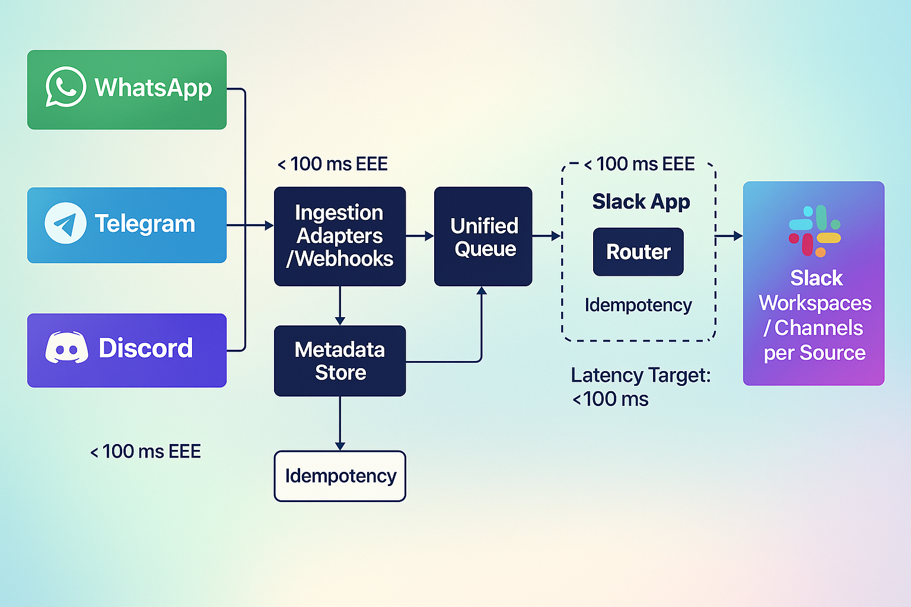

# Bitlink — Multi‑Platform Client Communication Hub

> Centralize client conversations from **WhatsApp, Telegram, Discord** (and more) directly **inside Slack** — without asking clients to switch apps.

  

  
  
  

  
  

---
##
**Bitlink mirrors every client chat into Slack** in real time and lets your team reply from Slack back to the client’s original app. You keep your internal workflow; clients keep theirs. Result: *one place to see, search, and act on everything*.

---

## Problem Statement (Bitbash story)

At **Bitbash**, we work with clients who *live* on different apps — some on WhatsApp, others on Telegram or Discord. We tried moving everyone into a single system (Slack), but most clients prefer staying where they are. This led to:

- Scattered chats across months and apps, hidden from the rest of the team
- Missed context, repeated questions, inconsistent follow‑ups
- No single source of truth for PMs and developers

**Bitlink** solves this by bridging those apps *into Slack* — so the team gets full visibility without forcing clients to move.

### Outcomes
- **One inbox for the team**: every client conversation is visible in Slack
- **No app switching** for clients; **no blind spots** for the team
- **Searchable history** with metadata for audits and onboarding
- **Faster response times** and tighter project coordination

---

## What Bitlink Does

- **Two‑way sync** between Slack and client platforms (WhatsApp, Telegram, Discord; extensible).
- **Consistent channel mapping**: `#client-<company>-dm` per client/company.
- **Message capture & dedupe** to prevent loops and double‑posts.
- **Searchable history** in Slack with message metadata stored in the DB.
- **Role‑based isolation** so each developer only sees their own clients.

> Optional add‑ons: tagging, auto‑assignment, SLA timers, sentiment/NLP labels, CRM sync (Airtable/HubSpot), basic analytics.

---

## High‑Level Architecture

**Inbound (Client → Slack)**  
Listen → Normalize → Dedupe/Store → Post to mapped `#client-<company>-dm`

**Outbound (Slack → Client)**  
Listen to Slack channel events → Dispatch to the correct platform/user → Track status

## Security & Compliance

- Verify webhook signatures (Slack), app secrets (Meta), and bot tokens
- Principle of least privilege OAuth scopes
- Per‑tenant separation; audit logs for all outbound sends
- GDPR‑aware: easy export/delete by contact id

---

## Roadmap

- Email (IMAP/SMTP) bridge
- Auto‑tagging & sentiment labels
- SLA timers + escalations
- Command palette (e.g., `/bitlink assign @alice`) for ops shortcuts
- Insights dashboard: response times, message volume, breached SLAs

---

## Who Uses Bitlink

- **Agencies** managing dozens of clients across apps
- **Product teams** offering support via WhatsApp/Telegram but coordinating in Slack
- **Consultants** who want a clean archive of client decisions inside Slack

> Internal to Bitbash, Bitlink eliminates DM blind spots and cuts context‑switching.

---

## Demo

  

---

## Tech Stack

TypeScript · Node.js (NestJS/Express) · Slack Bolt · WhatsApp Cloud API · Telegram Bot API · Discord.js · Postgres (Prisma) · Redis · Docker

---

## Work With Us / Contact

- **Discord:** **https://discord.gg/vBu9huKBvy** 
- **Telegram:** **https://t.me/devpilot1** 

> Agencies: ask about **white‑label** deployment.

---

## Contributing

PRs & issues welcome. Please open an issue to discuss new adapters or integrations.

---

## License

© Bitbash. All rights reserved.  
